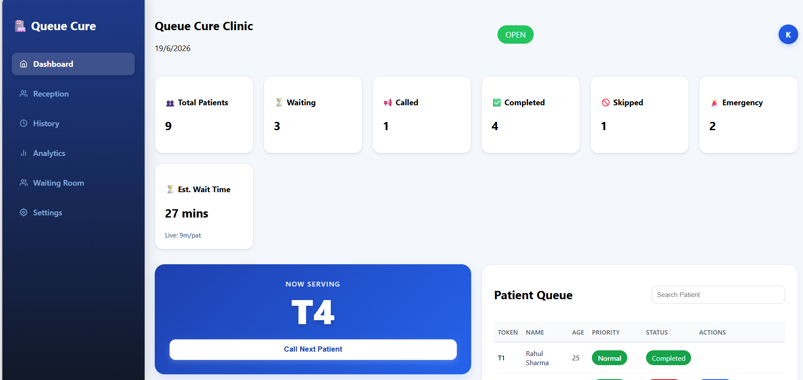
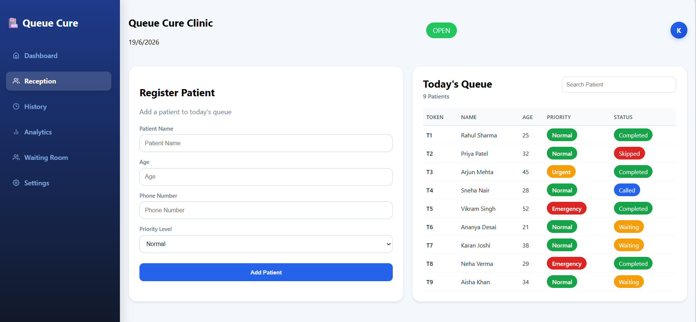
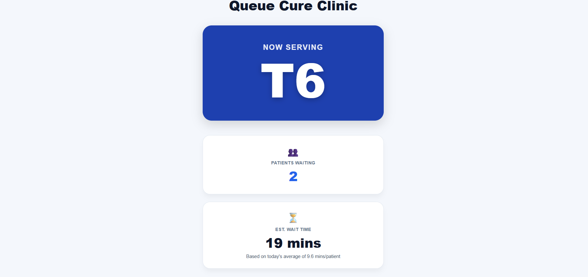
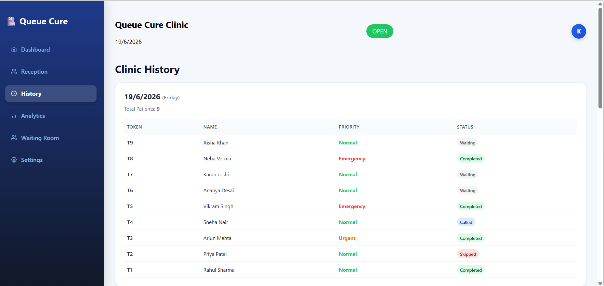
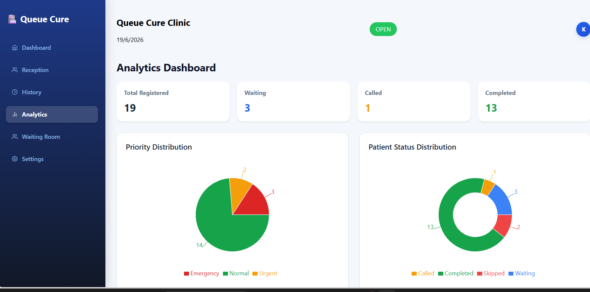
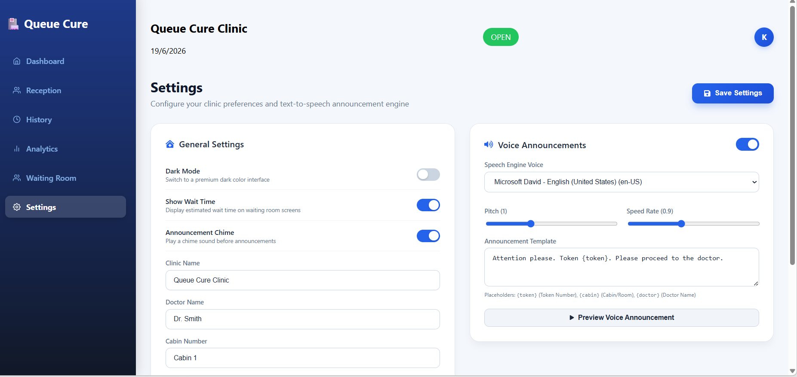

# 🏥 Queue Cure

Queue Cure is a modern healthcare queue management system designed for clinics, hospitals, diagnostic centers, and medical practices.

The platform digitizes patient registration, token generation, queue tracking, waiting room displays, voice announcements, clinic analytics, and patient history management.

Built with a modern full-stack architecture using React, Node.js, Express, MongoDB, and Socket.IO.

---

## ✨ Features

### 📋 Reception Dashboard

- Register new patients
- Auto-generate token numbers
- Priority based queue management
- Search patients instantly
- Call Next Patient
- Complete Patient
- Skip Patient
- Recall Skipped Patients

---

### 🔔 Smart Queue Management

Priority handling:

- 🔴 Emergency
- 🟠 Urgent
- 🟢 Normal

Patients are called automatically according to priority.

---

### 📢 Live Waiting Room Display

- Live token updates using Socket.IO
- Now Serving display
- Patients Ahead counter
- Estimated wait time
- Voice announcements
- Public display mode for clinic TVs

---

### 📊 Analytics Dashboard

- Total Patients
- Waiting Patients
- Called Patients
- Completed Patients
- Emergency Cases
- Priority Distribution Chart

---

### 📜 History Tracking

- Date-wise patient grouping
- Clinic session records
- Status history
- Archived clinic data

---

### ⚙️ Settings

- Dark Mode
- Voice Announcements
- Clinic Name Configuration
- Doctor Name Configuration
- Cabin Number Configuration
- Wait Time Configuration

---

## 🛠 Tech Stack

### Frontend

- React.js
- React Router DOM
- Axios
- Recharts
- Lucide React
- CSS3

### Backend

- Node.js
- Express.js
- Socket.IO

### Database

- MongoDB
- Mongoose

### Real-Time Communication

- Socket.IO

---

# 📸 Screenshots

## Dashboard



## Reception Dashboard



## Waiting Room Display



## History Page



## Analytics Dashboard



## Settings Page



---

# 🚀 Installation

## Clone Repository

```bash
git clone https://github.com/nairkartik08/queue-cure-2026.git
```

```bash
cd queue-cure-2026
```

---

## Backend Setup

Install backend dependencies:

```bash
npm install
```

Create a `.env` file in the root directory:

```env
MONGO_URI=your_mongodb_connection_string
PORT=5000
```

Start backend server:

```bash
npm start
```

---

## Frontend Setup

Open a new terminal:

```bash
cd frontend
```

Install frontend dependencies:

```bash
npm install
```

Start frontend:

```bash
npm run dev
```

Frontend will run on:

```text
http://localhost:5173
```

Backend will run on:

```text
http://localhost:5000
```

---

# 📂 Project Structure

```
QueueCure
│
├── frontend
│   ├── src
│   ├── public
│   └── package.json
│
├── backend
│   ├── routes
│   ├── models
│   ├── config
│   └── server.js
│
└── README.md
```

---

# 🔄 Queue Workflow

1. Patient registers
2. Token generated automatically
3. Patient enters waiting queue
4. Reception clicks Call Next
5. Waiting Room updates instantly
6. Voice announcement plays
7. Doctor consultation
8. Reception marks patient as Completed
9. Record stored in History

---

# 🎯 Future Enhancements

- Multi-doctor support
- SMS notifications
- WhatsApp alerts
- Appointment booking
- PDF reports
- Cloud deployment
- Admin dashboard
- Mobile application

---

# 👨‍💻 Author

**Kartik Nair**

Second Year Engineering Student

GitHub:
https://github.com/nairkartik08

Built as a healthcare-focused full stack project using React, Node.js, MongoDB and Socket.IO.

---

## ⭐ If you like this project

Give it a star on GitHub ⭐